<div align="center">

[](https://git.io/typing-svg)

</div>

---

## About Me

```python
chehab = {
    "name":       "Tiago de Jesus Chehab",
    "location":   "Brasília, Brazil",
    "education":  [
        "B.Sc. Computer Science — IDP (8th semester)",
        "School of Artificial Intelligence — CUHK Shenzen (starting 2026)",
    ],
    "company":    "MLLC Tech (Co-Founder & AI Developer)",
    "current":    "Data Scientist & DBA @ CRM-DF",
    "languages":  ["Portuguese (native)", "English (fluent)"],
    "interests":  ["LLMs", "RAG", "ETL", "Data Visualization", "Offensive Security"],
    "hackathons": "🏆 5x top-5 placements, including 2× 1st place",
}
```

---

## Tech Stack

### Core Languages
<div align="center">


</div>

### Data & AI
<div align="center">


</div>

### Tools & Platforms
<div align="center">


</div>

---

## GitHub Stats

<div align="center">
  
</div>

<div align="center">
  
</div>

<div align="center">
  
</div>

---

## Hackathon Achievements

| Event | Year | Project | Result |
|-------|------|---------|--------|
| 🥇 Hackaton IDP | 2024.1 | Speech To Libras | **1st Place** |
| 🥇 Hackaton IDP | 2025.1 | DesabafaAI | **1st Place** |
| 🥈 Hackaton IDP | 2025.2 | Offensive Security | **2nd Place** |
| 🥈 AKCIT – Epicentro Goiás | 2025 | DesabafaAI | **2nd Phase** (largest AI hub in Latin America) |
| 🏅 Hackaton Brasília +TI | 2024.2 | PredAlert | **5th Place** |
| 🎤 CYBER NEXTGEN – Teckids SP | 2025 | DesabafaAI | **Speaker / Presenter** |

---

## Experience

```
📌 CRM-DF                        Data Scientist · DBA · ETL · Dev      Aug 2025 – Present
📌 MLLC Tech (Co-Founder)        AI Developer · Data Analyst            Founded – Present
📌 Construtora Energia           BI Panels · ETL · Data Analyst         May 2025 – Aug 2025
📌 Presidency of Brazil (SAPR)   Data Science · ETL                     Feb 2024 – Jul 2025
📌 IDP                           Teaching Assistant – Calculus II        Mar 2023 – Dec 2023
```

---

## Connect with Me

<div align="center">

[](https://www.linkedin.com/in/tiago-chehab/)
[](https://github.com/TChehab)
[](mailto:tiago.chehab@gmail.com)
[](https://cursos.alura.com.br/user/tiago-chehab)

</div>

---

<div align="center">


</div>


